# Data Mining Project

## Introduction
There are 3 tasks and each task consists of a dataset and our objective is to make accurate predictions using classifiers. Proper preprocessing should be done before building a model and the model should make predictions that are accurate and do not overfit the data.

## Files

### Task 1

- t1dectree.ipynb

- t1.naivebayes.ipynb

- t1randfor.ipynb

- t1svm.ipynb

### Task 2

- version2.ipynb
- version3.ipynb

### Task 3

#### Vehicle Type Prediction:
- bayes.ipynb

- sgd.ipynb

- nearcent.ipynb

- dectree.ipynb

- knear.ipynb

- randfor.ipynb

- svm.ipynb

- labprop.ipynb

#### Customer Type Prediction:

- c3bayes.ipynb

- c3dectree.ipynb

- c3knear.ipynb

## Task 1

### Data

**Files: Training.txt, label_training.txt**  

Consists of sparse data represented by removing rows containing 0s

**Data Format: Training.txt**  

- Information Id

- Feature Id

- Value of the features

**Data Format: label_training.txt**  

- Classes -1, -1

- 1 -> information

- -1 -> misinformation

### Details

Our goal was to fit the data using classification models, compute accuracy of the predicted
models and determine the optimal parameters.   

#### Challenges 

- Large number of features, n(features) > n(records). 

- Sparse data, most number of values are zero.  

#### Data Pre-processing (2 methods) 

- using pd.getdummies. 

- using pd.pivot table.   

Used pd.pivot table and filled up the Nan values with zeros (Since Sparse).

#### Data Transformation:  

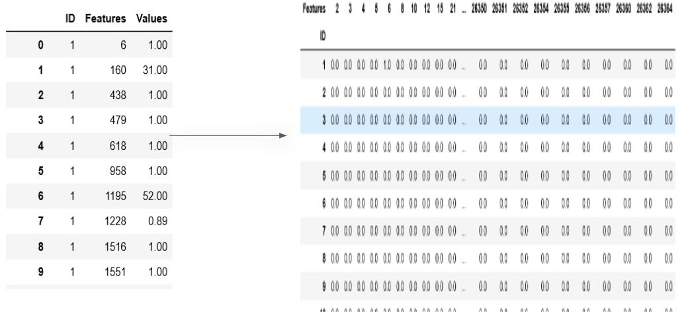 

#### Feature Selection

- Truncated Single Value Decomposition (SVD) - is a matrix factorization technique that factors a matrix M into the three matrices U, Σ, and V and it returns the principle components or features of the input dataframe or matrix. 

- Number of features returned - number specified in the function.
 
- Suitable for sparse data with a large number of features. 

#### Classifiers

- Decision Tree Classifier  
  - Parameters tuned - max_depth = 4,  min_samples_split = 276, criterion = 'gini'

- Support Vector Machine Classifier(SVM)
  - Parameters tuned - kernel = 'linear'

- Naive Bayes - Bernoulli and Gaussian
  - Parameter tuned - None

- Random Forest Classifier
  - Parameter tuned using RandomizedSearchCV

#### Visualized Results

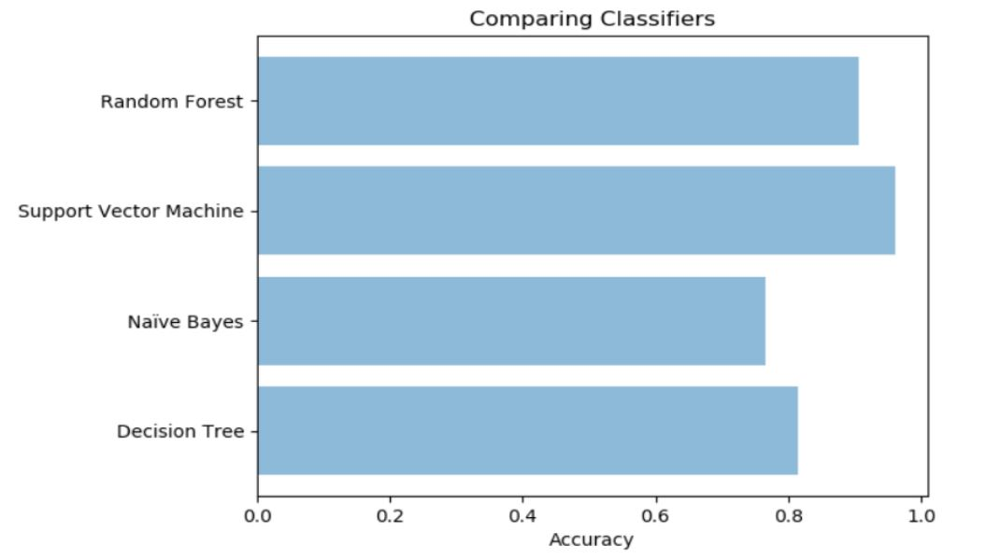  

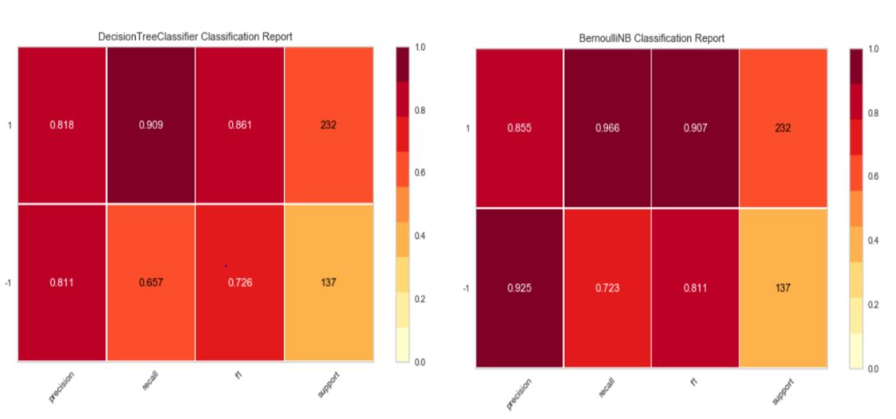  

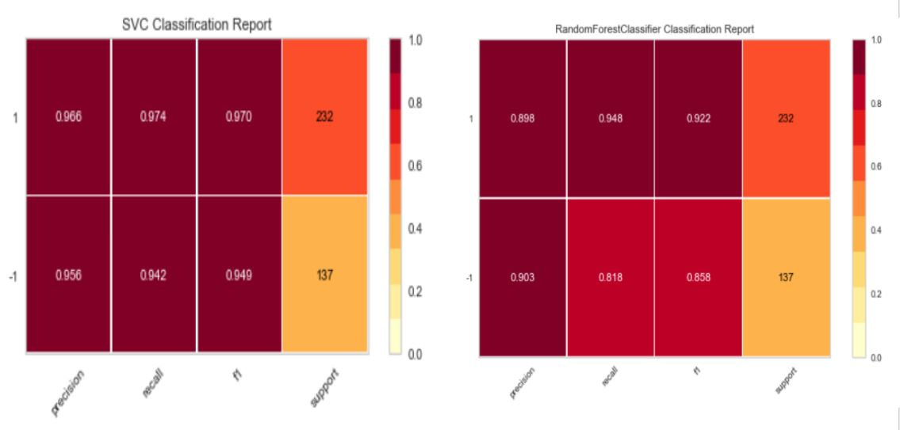  

## Task 2

### Data

Data was provided by the NDRC

- f-fin

- hr_rad_temp_pr_hu_drt-10

### Details

Our goal was to predict solar radiation level at the site Mojave Desert Shrub. We used data such as temperature, air pressure, soil temperature, and time to predict the solar radiation levels. Firstly we need our data. Credit goes to the NDRC (Nevada Desert Research Center) for providing the data. 

#### Challenges 

- A lot of factors can affect solar radiation that are hard to quantify in data (clouds and humidity).

- Discrepancies between sites due to things like elevation.

- Accounting for night time in our data (temp vs solar radiation) (huge difference in accuracy).   

#### Data Pre-processing 

- Looking for features that have some relation to Solar Radiation (temperature vs humidity vs tipping bucket)

- Don’t want to overfit but also don’t want to exclude valuable information.

- Account for day and night (multiple approaches). 

- Used Excel to remove unwanted rows and columns

#### Data Transformation 

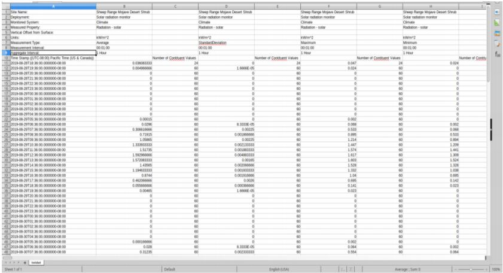 

#### Classifiers

- Linear Regression 

Alternatives:

- Neural Network

- Support Vector Machine

#### Visualized Results

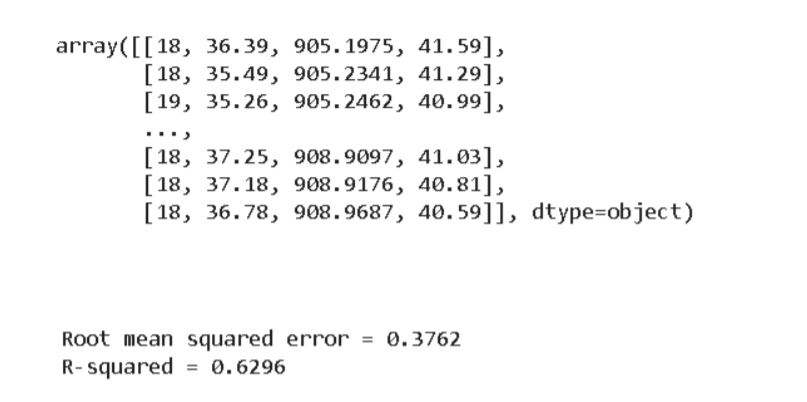  

#### Next Steps

Identify Harmful radiation:

- UV is identified as the main cause of sunburn.

- However it does not encompass the whole electromagnetic spectrum presented by solar radiance.

#### Sources

- [Sunburn Symptoms](https://www.mayoclinic.org/diseases-conditions/sunburn/symptoms-causes/syc-20355922)

- IARC Working Group on the Evaluation of Carcinogenic Risk to Humans. Radiation. Lyon (FR): International Agency for Research on Cancer; 2012. (IARC Monographs on the Evaluation of Carcinogenic Risks to Humans, No. 100D.) SOLAR AND ULTRAVIOLET RADIATION. Available from: [Link](https://www.ncbi.nlm.nih.gov/books/NBK304366/)

- [Ozone Facts](https://ozonewatch.gsfc.nasa.gov/facts/SH.html)

- [Increase in Solar Radiation](https://www.sciencedirect.com/science/article/abs/pii/S1011134496000188)

## Task 3

### Data

Data: Used auto purchase Dataset

- EXP REL Custom (Dictionary with column names and associated information)

- UsedAutoRELEVATEfirst10000-noLatLong

### Details

Our goal was to predict:

- Vehicle Type

- Customer Type

####  Challenges

- Data consisting of values of different types - Float, String, DateTime etc.

- Irrelevant Features - 280 Columns 

- Multiclass problem

- Missing values

#### Data Pre-processing  

- Skimmed through features and removed irrelevant ones.

- Eliminated columns with missing values more than 5166.

- Dealt with missing values using the following methods: Filling up with mean, preceding column values and zeros.

- Selected columns excluding type float and transformed them to numbers, methods used: Label Encoding, One-Hot Encoding.

#### Data Transformation 

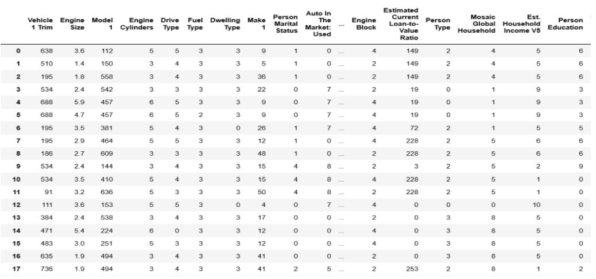 

#### Feature Selection

- Eliminated features by going through the remaining features of the dataframe

- Applied SelectKBest algorithm to select the best features that would most accurately predict labels.

#### Classifiers

- Decision Tree Classifier 

- K-nearest Neighbors Classifier

- Gaussian Naive Bayes Classifier

-Support Vector Machines Classifier

- Logistic Regression Classifier

- Label Propagation Classifier

- Multi-layer Perceptron(Neural Networks)

- Random Forest Classifier

- Nearest Centroid Classifier

- Stochastic Gradient Descent Classifier

#### Visualized Results

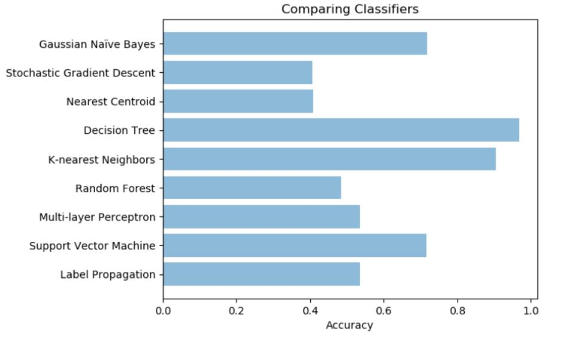  

**Visualized for the best 2** 

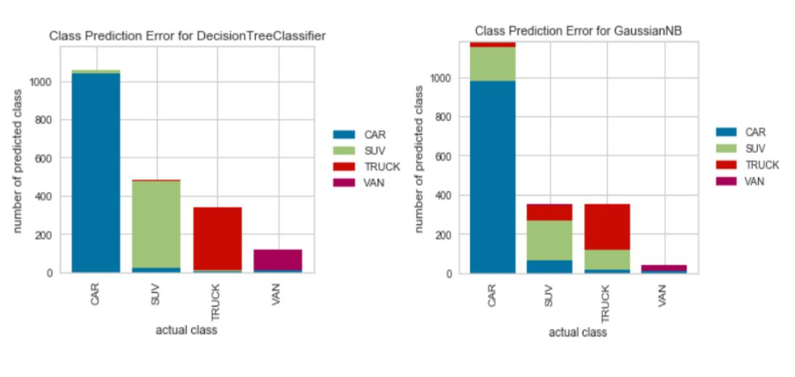  

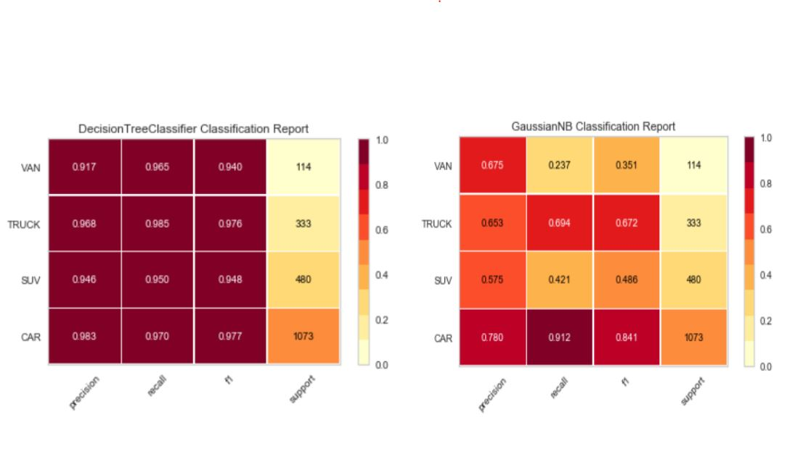  

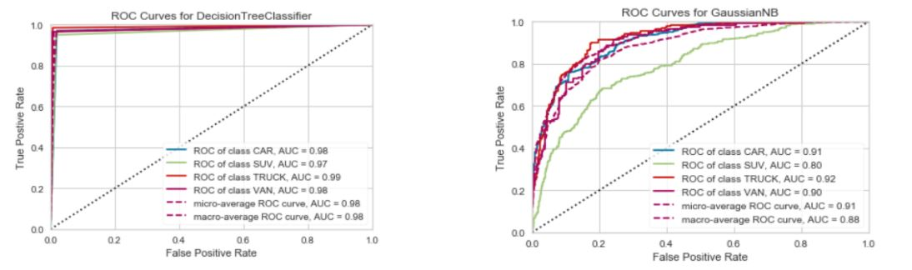  

## REFERENCES

- [DistrictDataLabs](https://anaconda.org/DistrictDataLabs/yellowbrick)

- [LogisticRegression](https://scikitlearn.org/stable/modules/generated/sklearn.linear_model.LogisticRegression.html)

- [DecisionTree](https://scikitlearn.org/stable/modules/generated/sklearn.tree.DecisionTreeClassifier.html)

- [NaiveBayes](https://scikit-learn.org/stable/modules/naive_bayes.html)

- [LabelvsOneHot](https://medium.com/@contactsunny/label-encoder-vs-one-hot-encoder-inmachine-learning-3fc273365621)

- [Get_Dummies](https://pandas.pydata.org/pandasdocs/stable/reference/api/pandas.get_dummies.html)

